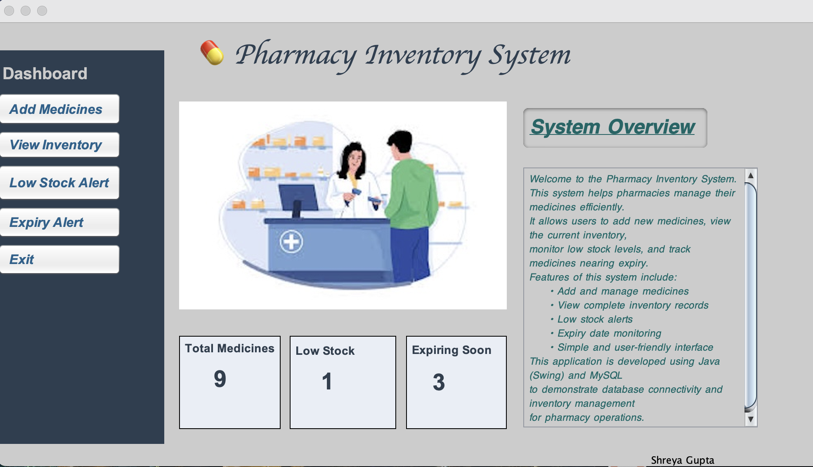
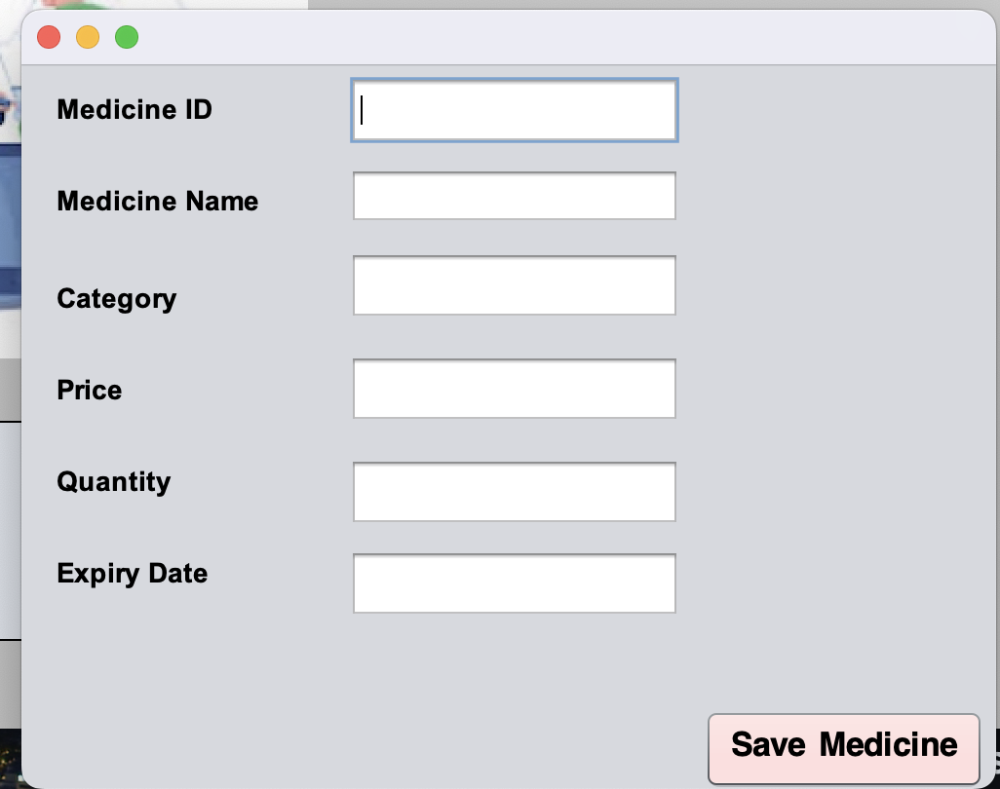
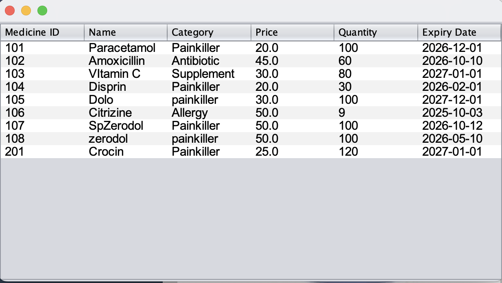
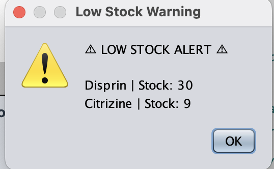
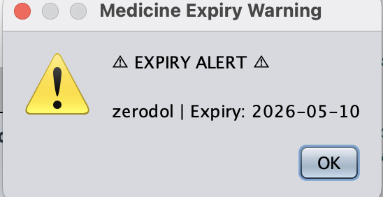
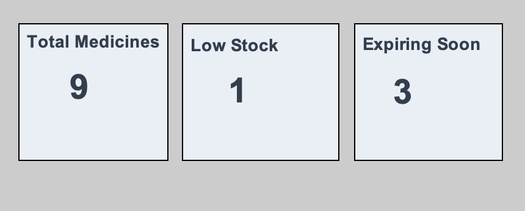

# 💊 Pharmacy Inventory Management System

A **Java Swing desktop application** designed to help pharmacies manage their medicine inventory efficiently.

## 📌 Features

* ➕ Add new medicines
* 📋 View complete inventory
* ⚠ Low stock alerts
* ⏳ Expiry alerts
* 📊 Dashboard showing total medicines, low stock, and expiring medicines

## 🛠 Technologies Used

* Java (Swing)
* MySQL
* JDBC
* NetBeans IDE

## 📷 Screenshots

### Dashboard

### Add Medicine

### View Inventory

### Low Stock Alert

### Expiry Alert

## ⚙ How to Run

1. Clone the repository
2. Open the project in **NetBeans IDE**
3. Configure **MySQL database connection**
4. Run the project

## 👩‍💻 Author

**Shreya Gupta**

GitHub:
https://github.com/Shreya1019
